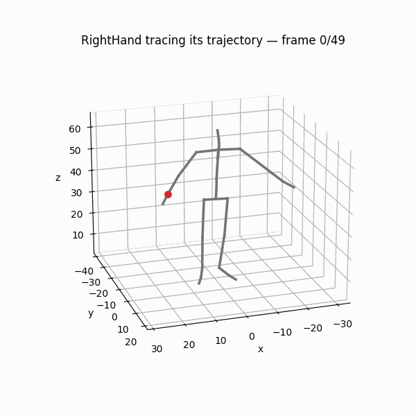

# pybvh

A lightweight Python library for reading, writing, and manipulating BVH motion capture files.

pybvh is framework-agnostic and outputs pure NumPy arrays. It understands motion capture data but does not assume what you'll do with it — the same library serves ML researchers, biomechanics scientists, and game developers.



<div class="grid cards" markdown>

- :material-rocket-launch: **[Quick Start](getting-started/quickstart.md)** — load a file, get NumPy arrays, write it back, in five minutes
- :material-image-multiple: **[Feature Gallery](gallery/index.md)** — every visual capability of the library, one picture and one call each
- :material-magnify: **[Find a function](api/index.md)** — "I want to…" → the exact call → its reference page
- :material-book-open-variant: **[User Guide](guide/core-concepts.md)** — the concepts: index spaces, centering, up axes, representations
- :material-school: **[Tutorials](tutorials.md)** — eight notebooks from first file to motion descriptors
- :material-download: **[Install](getting-started/installation.md)** — `pip install pybvh`; optional extras for visualization backends

</div>

## What can pybvh do?

- **Read & write** BVH files with full hierarchy and motion data preservation — [I/O API](api/io.md)
- **Rotation conversions** between [Euler angles, rotation matrices, quaternions, 6D, and axis-angle](guide/rotations.md) — all vectorized with NumPy
- **Forward kinematics** to compute [3D joint positions](guide/core-concepts.md) from angles
- **Skeleton operations**: [retargeting, scaling, joint extraction, Euler order changes](guide/skeleton-ops.md)
- **Frame operations**: [slicing, concatenation, resampling](guide/skeleton-ops.md) to different frame rates
- **Spatial transforms**: [mirroring, vertical rotation, speed perturbation, joint noise, root translation, frame dropout](guide/augmentation.md) — all with seeded randomization
- **Motion analysis**: [joint velocities/accelerations, root trajectory, foot contact detection](guide/feature-export.md), and a one-stop [`to_feature_array()`](api/features.md) export
- **Motion descriptors**: [trajectory geometry, dynamics (jerk, smoothness, kinetic energy), gait, and SE(3) rigid-transform math](guide/motion-descriptors.md) — all pure NumPy, each one [drawn in the gallery](gallery/index.md)
- **Signal utilities**: [finite differences, temporal statistics, smoothing, FFT, polyline simplification](api/signal.md)
- **Batch loading** of entire directories with [optional parallelism and dataset harmonization](guide/feature-export.md)
- **3D visualization** with [multiple backends](api/bvhplot.md) (matplotlib, OpenCV, k3d, vedo) — snapshots, video export, interactive playback

## Quick example

```python
import pybvh

bvh = pybvh.read_bvh_file("walk.bvh")
bvh.root_pos          # (F, 3) root translation
bvh.joint_angles      # (F, J, 3) Euler angles in radians

# Convert to 6D rotation representation
root_pos, rot6d = bvh.to_6d()

# Export features for ML
features = bvh.to_feature_array(representation="6d", include_velocities=True)
```

## Companion library

For ML-specific features (tensor packing, PyTorch Datasets, augmentation pipelines), see [pybvh-ml](https://victors-67.github.io/pybvh-ml/) ([repo](https://github.com/VictorS-67/pybvh-ml)).

## Stability and versioning

**pybvh is in 0.x — expect breaking changes between minor versions.** We treat 0.x as design space: when a past choice turns out to be wrong, we fix it at the root rather than carry scar tissue forward. Each release has a clear migration path in the [CHANGELOG](https://github.com/VictorS-67/pybvh/blob/main/CHANGELOG.md), no deprecation cycles. If you depend on pybvh from production code, **pin to an exact version** (`pybvh==0.8.0`) and read the upgrade notes before bumping.

pybvh will commit to strict semver at **1.0**: no breaking changes within a major version, deprecation warnings (at least one minor release) before any removal. Until then, "make the library better" wins over "preserve the old behavior."
